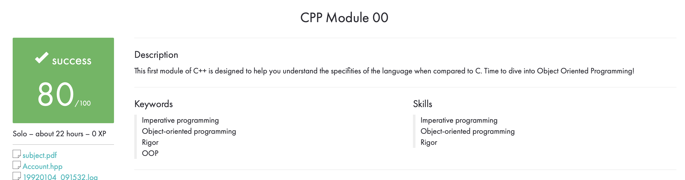
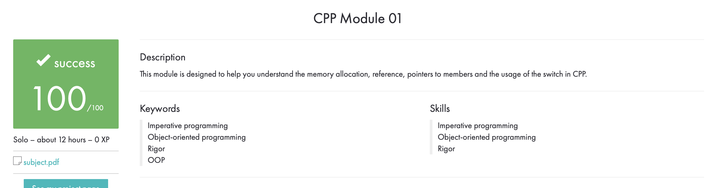
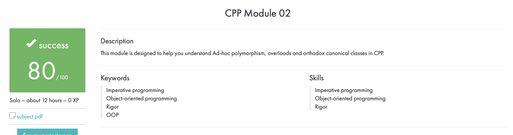
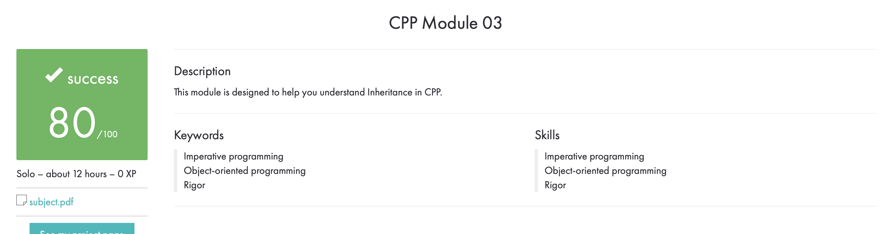
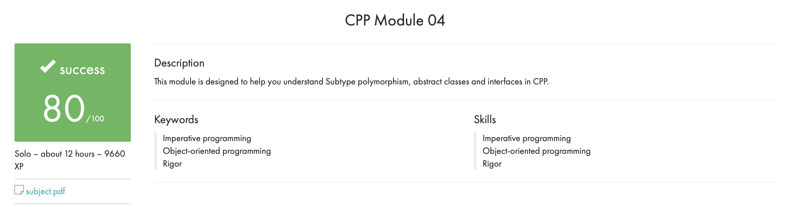

## CPP MODULE 00 - 42 SUBJECT - README

### Introduction

This repository contains my solutions to the exercises for module 00 of the CPP piscine at 42. The purpose of this module is to introduce C++ basics such as classes, member functions, and accessors.

